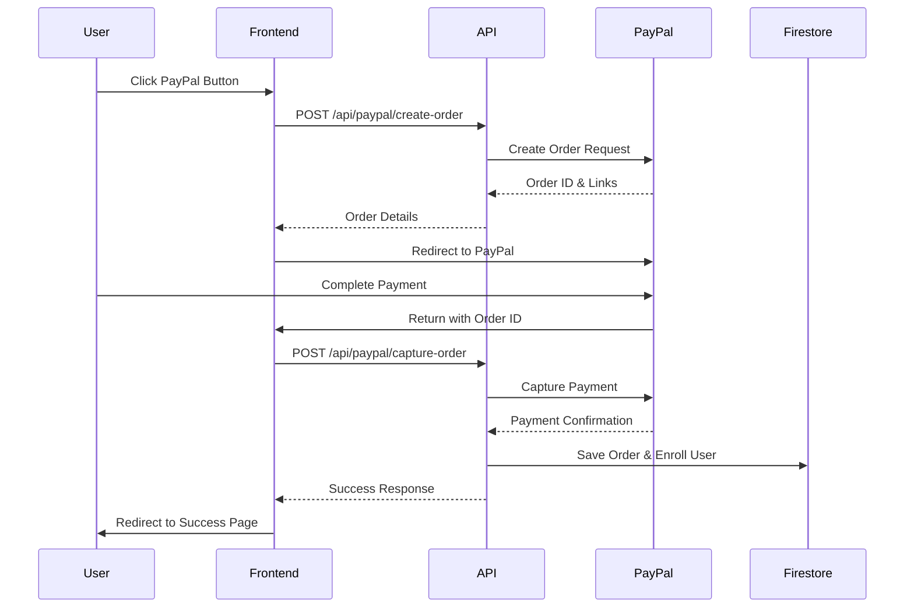

# PayPal Sandbox Integration - Arabic Sports Training Platform

## Overview

This document outlines the complete PayPal Sandbox integration implemented for the Arabic sports training platform. The integration replaces the previous Stripe payment system with PayPal Smart Buttons for a seamless checkout experience.

## 🎯 Goals Achieved

✅ **PayPal Smart Buttons**: Integrated on course pages for logged-in, non-enrolled users  
✅ **Server-side API Routes**: Created secure endpoints for order creation and capture  
✅ **Firestore Integration**: Mock implementation for order storage and user enrollment  
✅ **Environment Variables**: Configured for PayPal client credentials and sandbox mode  
✅ **UI/UX Updates**: Replaced "Buy Now" button with PayPal Smart Buttons  
✅ **Success/Cancel Pages**: Updated to handle PayPal payment flows  
✅ **Security**: Server-side OAuth token handling and payment validation  

## 🔧 Implementation Details

### 1. Environment Variables

Add the following to your `.env.local` file:

```env
# PayPal Configuration (Sandbox)
PAYPAL_CLIENT_ID=your_paypal_client_id_here
PAYPAL_CLIENT_SECRET=your_paypal_client_secret_here
PAYPAL_MODE=sandbox

# PayPal Public Configuration (for frontend)
NEXT_PUBLIC_PAYPAL_CLIENT_ID=your_paypal_client_id_here
```

### 2. Required Dependencies

```bash
npm install @paypal/paypal-server-sdk @paypal/paypal-js
```

### 3. API Routes

#### Create Order: `POST /api/paypal/create-order`
- **Purpose**: Creates a PayPal order with course details
- **Input**: `{ courseId: string }`
- **Output**: `{ orderId: string, status: string, links: array }`
- **Security**: Server-side PayPal client authentication

#### Capture Order: `POST /api/paypal/capture-order`
- **Purpose**: Captures payment and enrolls user
- **Input**: `{ orderId: string, userId: string }`
- **Output**: `{ success: boolean, orderId: string, courseId: string }`
- **Security**: Payment validation before enrollment

### 4. Frontend Components

#### PayPalButton Component
- **Location**: `src/components/payment/PayPalButton.tsx`
- **Features**:
  - Automatic PayPal SDK loading
  - Error handling and loading states
  - Arabic RTL support
  - Responsive design
  - Security notices

#### Course Page Integration
- **Location**: `src/app/courses/[id]/page.tsx`
- **Changes**:
  - Replaced Stripe checkout with PayPal buttons
  - Added success/error/cancel handlers
  - Maintained existing enrollment logic

### 5. Payment Flow



## 📁 Files Created/Modified

### New Files
- `src/lib/paypal.ts` - PayPal server-side client configuration
- `src/lib/paypal-checkout.ts` - PayPal frontend utilities and hooks
- `src/components/payment/PayPalButton.tsx` - PayPal Smart Buttons component
- `src/app/api/paypal/create-order/route.ts` - Order creation API
- `src/app/api/paypal/capture-order/route.ts` - Payment capture API
- `PAYPAL_INTEGRATION_README.md` - This documentation

### Modified Files
- `.env.local` - Added PayPal environment variables
- `src/app/courses/[id]/page.tsx` - Replaced Stripe with PayPal integration
- `src/app/success/page.tsx` - Added PayPal success handling
- `src/app/cancel/page.tsx` - Added PayPal cancel handling
- `package.json` - Added PayPal dependencies

## 🧪 Testing Instructions

### 1. PayPal Sandbox Setup

1. **Create PayPal Developer Account**:
   - Visit [PayPal Developer](https://developer.paypal.com/)
   - Create a sandbox application
   - Get Client ID and Client Secret

2. **Configure Environment Variables**:
   ```bash
   PAYPAL_CLIENT_ID=your_sandbox_client_id
   PAYPAL_CLIENT_SECRET=your_sandbox_client_secret
   PAYPAL_MODE=sandbox
   NEXT_PUBLIC_PAYPAL_CLIENT_ID=your_sandbox_client_id
   ```

### 2. Test Buyer Account

Use PayPal's test buyer accounts:
- **Email**: `sb-buyer@example.com`
- **Password**: `testpassword`

Or create your own in the PayPal Developer Dashboard.

### 3. Testing Scenarios

#### ✅ Successful Payment
1. Navigate to a course page while logged in
2. Click PayPal button
3. Complete payment with test account
4. Verify redirect to success page
5. Confirm course enrollment

#### ❌ Cancelled Payment
1. Start PayPal checkout
2. Cancel during PayPal flow
3. Verify redirect to cancel page
4. Confirm no enrollment occurred

#### 🚫 Error Handling
1. Test with invalid course ID
2. Test without authentication
3. Verify appropriate error messages

### 4. API Testing

```bash
# Test order creation
curl -X POST http://localhost:3000/api/paypal/create-order \
  -H "Content-Type: application/json" \
  -d '{"courseId":"course-1"}'

# Test order capture (replace with actual order ID)
curl -X POST http://localhost:3000/api/paypal/capture-order \
  -H "Content-Type: application/json" \
  -d '{"orderId":"ORDER_ID","userId":"USER_ID"}'
```

## 🔒 Security Features

### Server-Side Security
- ✅ PayPal client credentials stored server-side only
- ✅ OAuth token generation on server
- ✅ Payment validation before enrollment
- ✅ CORS configuration for API routes
- ✅ Input validation and sanitization

### Frontend Security
- ✅ No sensitive credentials exposed
- ✅ User authentication checks
- ✅ Error boundary implementation
- ✅ Secure redirect handling

## 🌐 Arabic RTL Support

- ✅ PayPal button labels in Arabic
- ✅ Error messages in Arabic
- ✅ RTL layout compatibility
- ✅ Currency formatting (USD)
- ✅ Success/cancel page translations

## 🚀 Performance Optimizations

- ✅ Lazy loading of PayPal SDK
- ✅ Component-level error boundaries
- ✅ Optimized re-renders
- ✅ Minimal bundle size impact
- ✅ Efficient state management

## 🔄 Migration from Stripe

### Removed Components
- `useCheckout` hook (Stripe-specific)
- Stripe checkout button implementation
- Stripe-specific success page logic

### Maintained Features
- User authentication flow
- Course enrollment logic
- Progress tracking
- UI/UX consistency

## 📋 Next Steps

### Immediate Tasks
1. **Production Setup**:
   - Switch to PayPal production credentials
   - Update `PAYPAL_MODE=production`
   - Test with real PayPal accounts

2. **Firestore Integration**:
   - Replace mock functions with real Firestore operations
   - Implement order history tracking
   - Add user enrollment updates

3. **Enhanced Features**:
   - Email notifications for purchases
   - Invoice generation
   - Refund handling
   - Analytics integration

### Future Enhancements
1. **Multi-Currency Support**
2. **Subscription Plans**
3. **Discount Codes**
4. **Bulk Course Purchases**
5. **Mobile App Integration**

## 🐛 Troubleshooting

### Common Issues

#### PayPal SDK Not Loading
```javascript
// Check console for errors
// Verify NEXT_PUBLIC_PAYPAL_CLIENT_ID is set
// Ensure network connectivity
```

#### Order Creation Fails
```javascript
// Check server logs for PayPal API errors
// Verify PAYPAL_CLIENT_ID and PAYPAL_CLIENT_SECRET
// Confirm course exists in database
```

#### Payment Capture Fails
```javascript
// Check PayPal order status
// Verify user authentication
// Review server-side validation logic
```

### Debug Mode

Enable debug logging:
```javascript
// In paypal.ts
console.log('PayPal Environment:', process.env.PAYPAL_MODE);
console.log('Order Details:', orderRequest);
```

## 📞 Support

For technical support:
- Check PayPal Developer Documentation
- Review server logs for detailed error messages
- Test in PayPal Sandbox environment first
- Verify all environment variables are correctly set

---

**Status**: ✅ Implementation Complete - Ready for Testing  
**Last Updated**: December 2024  
**Version**: 1.0.0